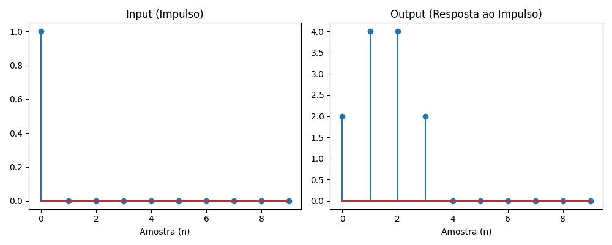

# ⚡ Acelerador de Filtro FIR em VHDL com Verificação Python

Este projeto demonstra minha competência híbrida em **Engenharia de Software Embarcado** e **TI/Programação**. Eu projetei um bloco de hardware fundamental (um filtro FIR de 4-taps) em VHDL e, em seguida, criei um "Golden Model" (Modelo de Ouro) em Python para verificar matematicamente a corretude do design VHDL.

Este é um fluxo de trabalho de verificação padrão na indústria de semicondutores, mostrando a integração entre o design de hardware (Engenharia) e a automação de testes (TI).

## 🚀 O Projeto

Este repositório contém 3 componentes principais:

1.  **`fir_filter.vhd`**: O design de hardware (DUT - Device Under Test). É um filtro FIR síncrono, parametrizável, com 4 coeficientes (`[2, 4, 4, 2]`).
2.  **`tb_fir_filter.vhd`**: O *Testbench* VHDL. Este script simula o hardware, injetando sinais de "impulso" e "degrau" para testar a resposta do filtro.
3.  **`verify_filter.py`**: O "Golden Model" (Modelo de Ouro) em Python. Este script usa `SciPy` e `NumPy` para recriar *matematicamente* o mesmo filtro. Ele serve como a "prova" de que o design VHDL está correto.

## 📊 Verificação (Python Golden Model)

O script Python prova que o design VHDL implementa corretamente a equação de diferença. A saída do "Teste de Impulso" do script (a "Resposta ao Impulso") revela os coeficientes do filtro (`[2, 4, 4, 2]`), e o "Teste de Degrau" confirma o ganho DC do filtro (`12 * 5 = 60`).

### Resposta ao Impulso
(Prova que os coeficientes `[2, 4, 4, 2]` estão corretos)



### Resposta ao Degrau
(Prova que o ganho do filtro está correto, estabilizando em 60)


## 🛠️ Tecnologias Utilizadas

* **Engenharia de Hardware:** VHDL
* **Verificação & Análise:** Python
* **Bibliotecas Python:** NumPy, SciPy, Matplotlib
* **Conceitos de Engenharia:** Processamento Digital de Sinais (DSP), Filtros FIR, Arquitetura de Hardware Síncrona, Verificação de Design.

## 🏁 Como Executar (Verificação)

Para rodar a verificação em Python e gerar os gráficos:

1.  Clone o repositório:
    ```bash
    git clone [https://github.com/K1ngKr1ns0n/vhdl-repository-accelerator.git](https://github.com/K1ngKr1ns0n/vhdl-repository-accelerator.git)
    cd vhdl-repository-accelerator
    ```
2.  Crie um ambiente virtual e instale as dependências:
    ```bash
    python -m venv venv
    source venv/bin/activate
    pip install -r requirements.txt
    ```
3.  Execute o script de verificação:
    ```bash
    python verify_filter.py
    ```
